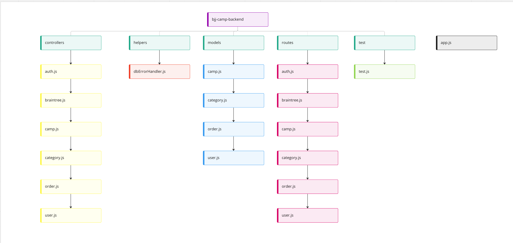

<h1 align='center'>Brazilian Jiu-Jitsu Camps - backend | MERN application</h1>
<br />

## Project information

<p align='center'>My goal with this project was to allow the BJJ interested people to book training camps in different parts of the world. Based on their belt degree, and the amount of money they want to pay. The project is also implemented with Paypal and VISA system using braintree API. A user can book, filter, search camps. A user can also login, register and browse certain parts of the webpage without having to create an account. There is also an Admin route, where the admin can delete or add a camp. An admin is also authorized to delete or update a user. For example, an admin can upgrade a user from white to blue belt. </p>
<br />

<h4>Project links</h4>
<a href="#" target="_blank">Go to app</a> | <a href="https://github.com/onurkayhann/bjj-camp-frontend" target="_blank">Frontend Repo for the App</a> | <a href="https://github.com/onurkayhann/bjj-camp-backend" target="_blank">Backend Repo for the App</a> | <a href="https://www.figma.com/file/ptLf36k5QMRNGDQConA9AY/u09-fullstack-project?node-id=0%3A1" target="_blank">Figma work</a> | <a href="https://docs.google.com/document/d/1Xw3Oq3rEVeF-vSE9ItOklfLu34bz1IKPrZkm5GKRyr4/edit" target="_blank">Interviews</a> | <a href="https://docs.google.com/document/d/14vXOq5Yp2ya-JlO1_fkgj6u9mUudmgGWu6q3Rm2TWzY/edit" target="_blank">Backlog</a> | <a href='https://github.com/onurkayhann?tab=projects' target='_blank'>Sprints</a>

### Used languages to create this App

- [React.js](https://reactjs.org/)
- [Bootstrap](https://getbootstrap.com/)
- [CSS](https://css-tricks.com/)
- [NodeJS](https://nodejs.org/en/)
- [ExpressJS](https://expressjs.com/)
- [MongoDB](https://www.mongodb.com/)

### Routes and navigation

| Path                                                              | Type    | Access  |
| ----------------------------------------------------------------- | ------- | ------- |
| **Camp**                                                          |
| Get all camps: <br /> `/api/camps`                                | GET     | Public  |
| Get camps based belt degree: <br /> `/api/camps/related/{campId}` | GET     | Public  |
| **Admin**                                                         |
| Create a camp: <br /> `/api/camp/create/{userId}`                 | POST    | Admin   |
| Delete a camp: <br /> `/api/camp/{campId}/{userId}`               | DELETE  | Admin   |
| Update a camp: <br /> `/api/camp/{campId}/{userId}`               | PUT     | Admin   |
| Update a user: <br /> `/api/user/admin/{userId}`                  | PATCH   | Admin   |
| Delete a user: <br /> `/api/user/{userId}`                        | DELETE  | Admin   |
| **User**                                                          |         |
| Register: <br /> `/api/signup`                                    | POST    | Public  |
| Login: <br /> `/api/signin`                                       | POST    | Private |
| Logout: <br /> `/api/signout`                                     | GET     | Private |
| Book camp: <br /> `/api/order/create/{userId}`                    | POST    | Private |

### Deployment

Coming soon...

## How to get starting with the app

### Installation steps

1. Clone the repo
   ```sh
   git clone https://github.com/onurkayhann/bjj-camp-backend
   ```
2. Install NPM packages (In the client and server folders)
   ```sh
   npm install
   ```
3. Create your .env
   ```JS
   PORT = 8000
   MONGO_DB = ENTER MONGO URI
   JWT_SECRET = ENTER YOUR OWN SECRET KEY
   BRAINTREE_MERCHANT_ID = ENTER YOUR MERCHANT ID
   BRAINTREE_PUBLIC_KEY = ENTER PUBLIC KEY
   BRAINTREE_PRIVATE_KEY = ENTER YOUR PRIVATE KEY
   ```
4. Run
   ```sh
   npm run data:import
   ```
5. Run
   ```sh
   npm start
   ```

## Fulfilled requirements

- RESTful API
- Responsiveness
- User Register, Login, and Logout
- User can search in the search field
- User can filter through prices and belt degrees
- Users can use PayPal or VISA to pay for their bookings

## Sitemap for backend



## License

MIT license

## Thanks to providers

I am super grateful that some people from the UX Designer program participated in my pre-work, and allowed me, to interview them. Thank you Victoria, Isabel, Neda, and Sandra.

## Get in touch with me

Email - onur.kayhan@chasacademy.se
<br />
LinkedIn: [Onur Kayhan](https://www.linkedin.com/in/onur-kayhan-02b770234/)
<br />
[My website](https://onur-portfolio.netlify.app/)
